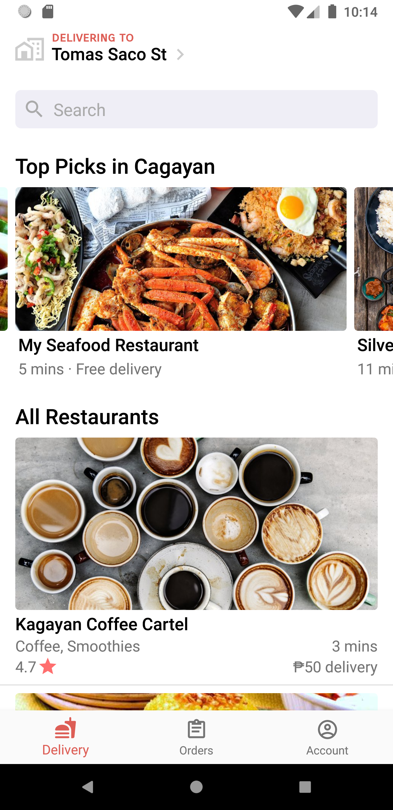
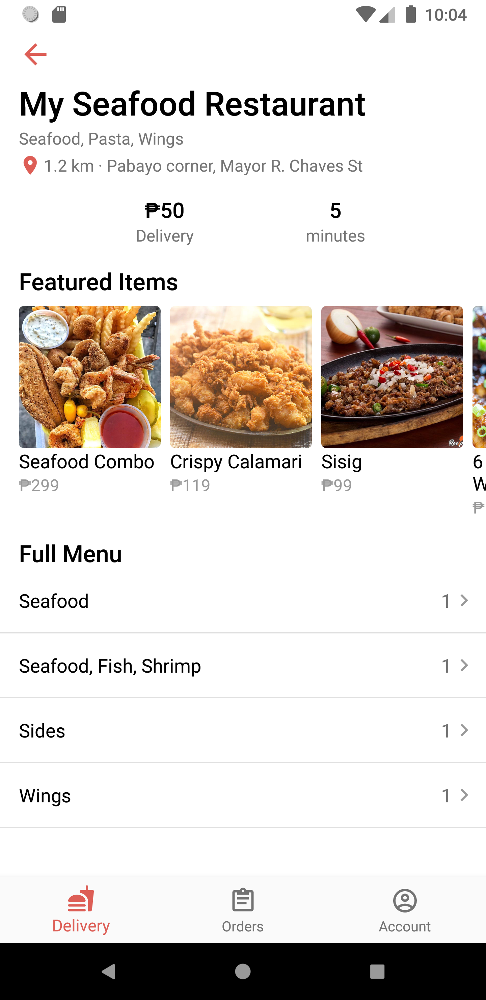
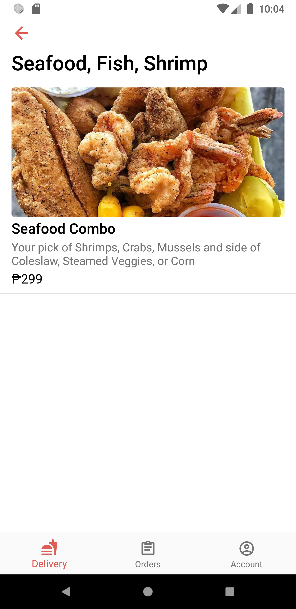
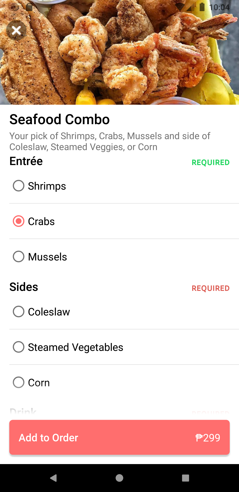
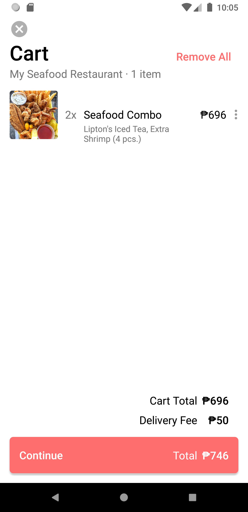
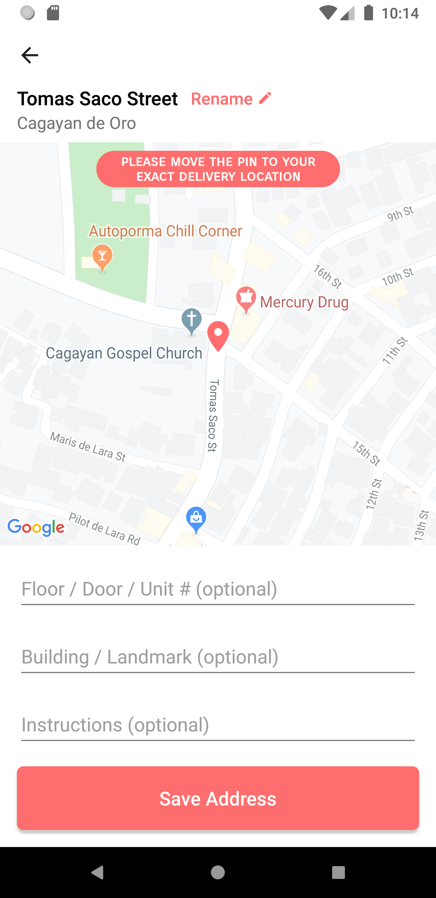

# QuickBite-android

Proof-of-concept food delivery app 🍔 Fully functional. Written in Kotlin.

iOS version: https://github.com/gsmalley10/QuickBite

## Technical Features
- Google & Facebook Sign In
- Reverse geolocation lookup for delivery addresses (Google Places SDK)
- Google Maps SDK integration
- Push notifications
- Firebase integration & realtime updates
- Crashlytics crash reporting
- Modern and responsive UI

<table><tr><td>
    
  </td><td></td></tr>
<tr><td>
    
</td><td>
    
</td></tr>
<tr><td>
    
</td><td>
    
</td></tr>
</table>
